# VMP_FixIat

搜索需要修复的IAT后进行修复后DUMP。

## 使用方法

需要手动找到OEP位置，然后进行修复

```c++
#include <iostream>
#include"iat.h"
int main()
{
    //进程ID，和欲修复的模块名
    iat _iat{ 30932,"contest.exe" };
    //返回需要修复iat的地址;.text起始地址和大小、.vmp0的地址地址和大小
    std::vector<uint64_t> iatlist = _iat.search_IAT(0x00007FF7A27A1000, 0x26000, 0x00007FF7A2889000, 0x370000);
    if (iatlist.size() <= 0)
    {
        MessageBoxA(NULL, "not found iat", "pjvmp", NULL);
        return 0;
    }

    std::vector<IatInfo> fix_result = _iat.process_IAT(iatlist);
    if (_iat.fix_IAT(fix_result))
        MessageBoxA(NULL, "fix iat success", "pjvmp", NULL);
    else
    {
        MessageBoxA(NULL, "fix iat failed", "pjvmp", NULL);
        fix_result.clear();
    }

	//手动提供OEP和保存的路径
    if (_iat.fix_Dump(0x1945C, fix_result, "contest.exe.pjvmp"))
        MessageBoxA(NULL, "fix dump success", "pjvmp", NULL);
    else
        MessageBoxA(NULL, "fix dump failed", "pjvmp", NULL);

    return 0;
}
```

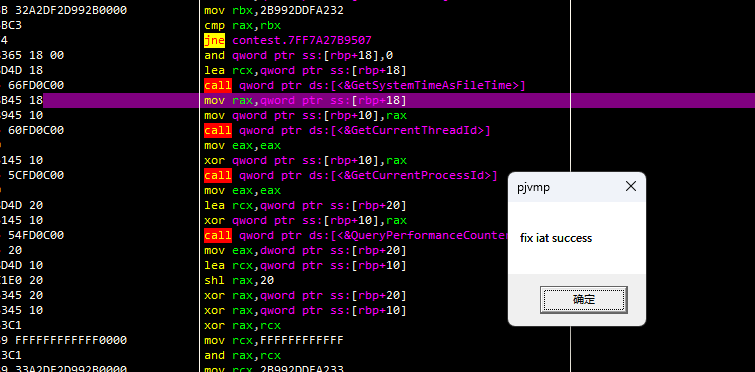

修复后的节区保存了IAT数据。

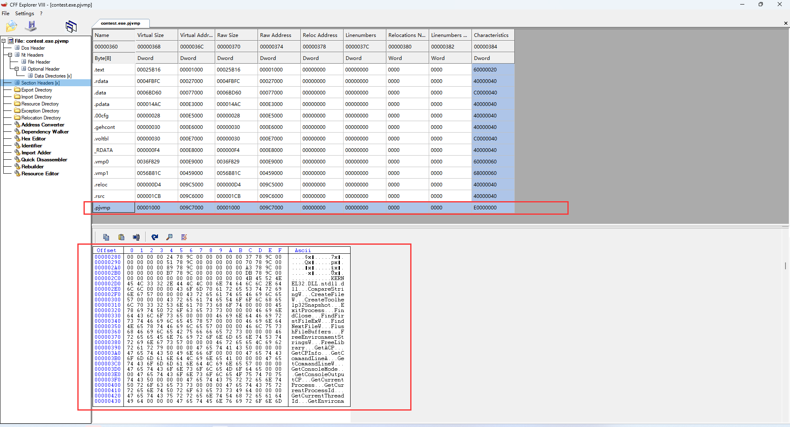

## 思路

### 修复IAT

由于iat的保护方式为 call .vmp0，并且头字节都为nop.因此可以暴力搜索特征。

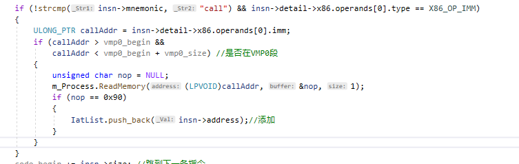

x86和x64的保护和还原方式略有差异，以下主要是以x64为例。

原代码中调用iat的方式有下列三种：

```
6 bytes:call [iat]
7/10 bytes:mov reg,[iat] / call reg
6 bytes:jmp [iat]
```

VMP中均以call .vmp0保护，但是由于call只有5个字节，因此vmp会额外添加无效指令进行填充。

- 1+call：无效1字节+call指令

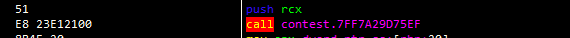

- call+1：call指令+无效1字节

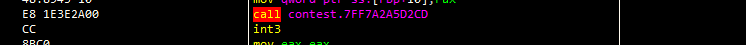

其中原指令的还原需要根据call地址中的代码进行判断。

call [iat]:

```assembly
push rdx
mov rdx,qword ptr ss:[rsp+8]   ;获取ret_addr
lea rdx,qword ptr ds:[rdx+1]   ;返回到地址+1,说明为call+1
mov qword ptr ss:[rsp+8],rdx
...
ret
```

```assembly
nop 
movsx cx,bh
mov ecx,6090101D
movzx rcx,r12w
pop rcx	;获取ret_addr
xchg qword ptr ss:[rsp],rcx ;由于上边弹出后，[rsp]=上一层push的值,这里进行一个交换后,[rsp]=真实的ret_addr,rcx的值恢复
...
ret
```

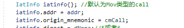

mov reg,[iat]:

```assembly
...
mov qword ptr ss:[rsp+8],rdi
movzx rdi,r14w
setbe dil
lea rdi,qword ptr ds:[7FF7A27AA21D]
cmovl r14,rsp
movzx r14,r15w
mov rdi,qword ptr ds:[rdi+24EBD4]
movsx r14d,r11w
lea rdi,qword ptr ds:[rdi+2F5557FD]
mov r14,697D5F0C
not r14d
movsx r14,bp
mov r14,rdi    ;最后把真实的api地址赋值给寄存器,然后ret
ret
```

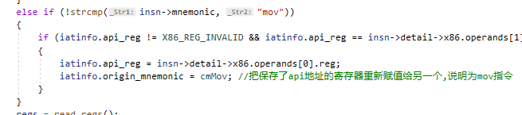

jmp [iat]:

```assembly
nop 
movsx cx,bh
mov ecx,6090101D
movzx rcx,r12w
pop rcx	;获取ret_addr
xchg qword ptr ss:[rsp],rcx ;由于上边弹出后，[rsp]=上一层push的值,这里进行一个交换后,[rsp]=真实的ret_addr,rcx的值恢复
...
ret xxx //由于jmp不会压栈,因此vmp需要对栈进行恢复
```

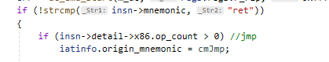

根据这些特征可以继续判断原指令，然后进行修复。

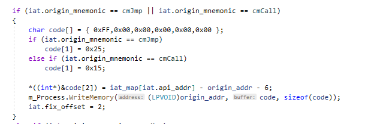

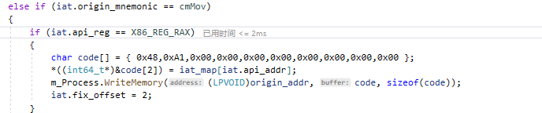

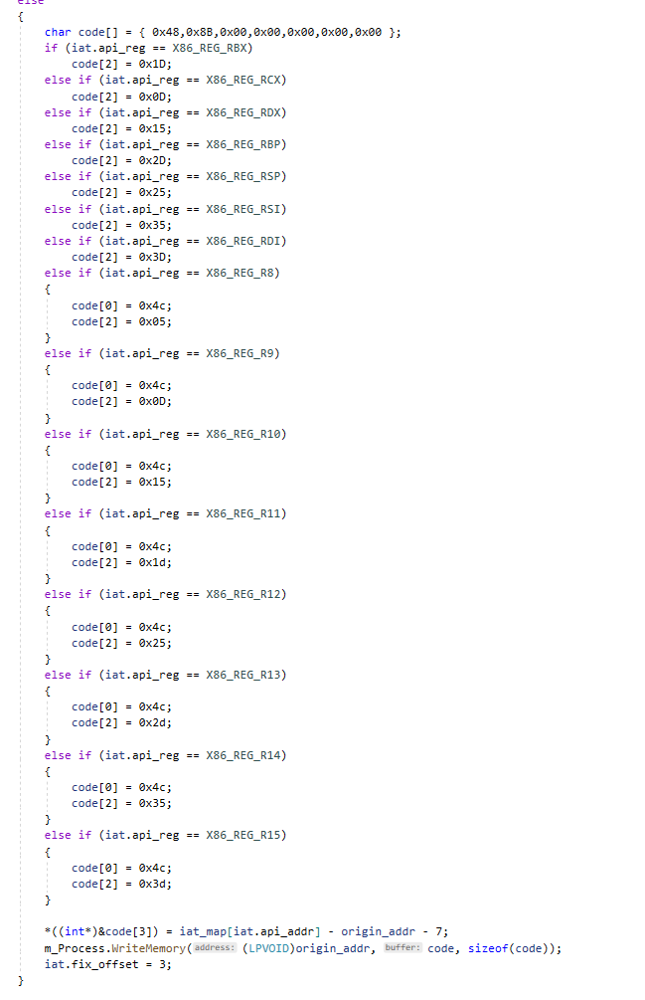

修复后效果：

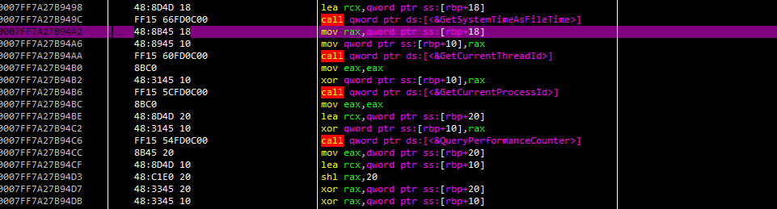


由于x64的跳转问题，修复时默认修复到.vmp0段中。

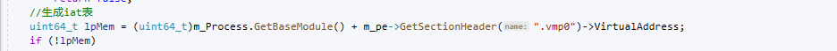

### 构建IAT，DUMP

所有的数据都按照如下顺序存放：

list<描述符>

list<模块名>

list<thunk\name>

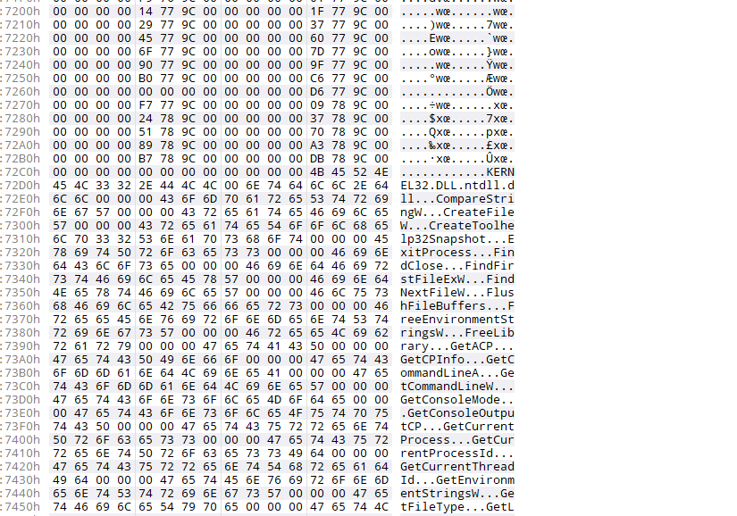

首先是计算iat总共的数据大小

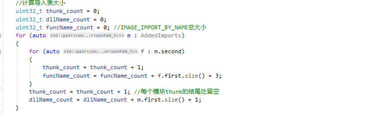

然后分别计算每个数据存放的偏移。


for循环进行存放。

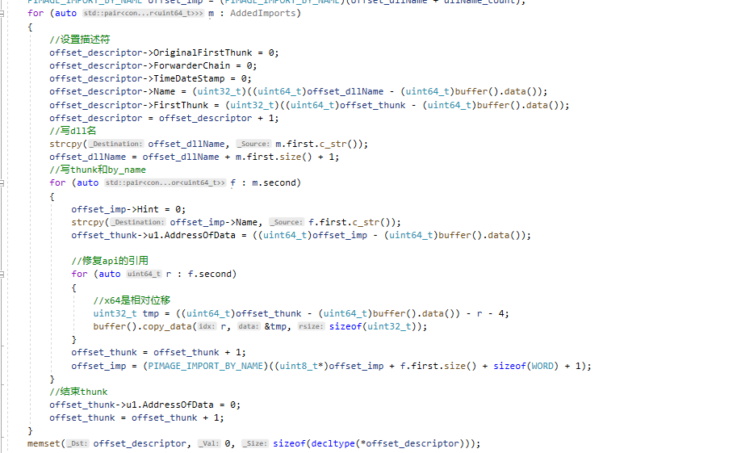

其中修复时需要注意的是。

x64中，call/jmp/mov存放的硬编码为相对位移。

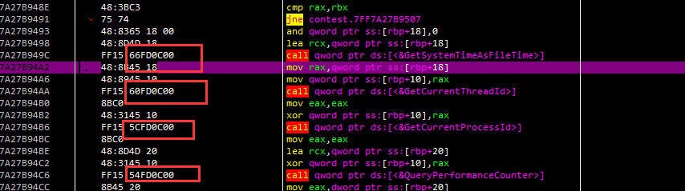


